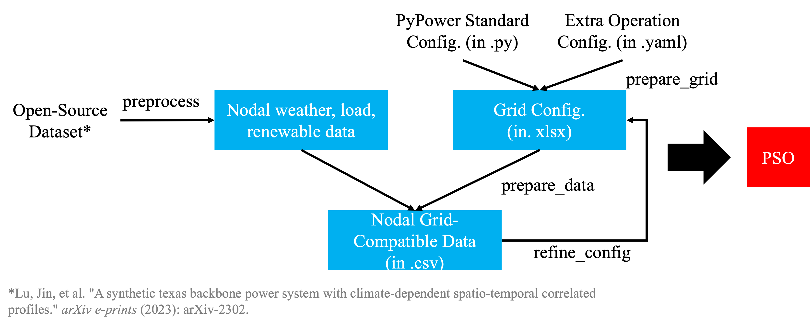

# LAPSO: Learning-Augmented Power System Operation

This repository contains the code for paper "LAPSO: A Unified Optimization View for Learning-Augmented Power System Operation for Economic and Stability Scheduling" by Wangkun Xu (Imperial College London), Zhongda Chu (Tianjin University), and Fei Teng (Imperial College London). The paper is under review and more code will be released after the review process. This repository is maintained by Wangkun Xu.

 This work was funded by EPSRC under Grant EP/Y025946/1.

Two main packages are included:
- `pso`: for automatic power system testbed and data generation.
- `lapso`: for automatic integrating machine learning models into existing power system optimization models.

Together with the detailed experiments mentioned in the paper, as applications of LAPSO.

The structure of the repository is
```
LAPSO_EXP
├── lapso/                  # The main folder for LAPSO (can be used independently, **coming soon**)
├── pso/                    # The folder for power system data and configuration generator (can be used independently)
├── requirements.txt        # The dependencies of the project (**coming soon**)
├── README.md               # This file
├── paper_exp/              # The folder for the case studies in the paper
    ├── obf_func.py           # Helper functions for obf
    ├── train_abf_nn.py       # NN-based P_{train}^{abf}
    ├── obf_basic.py          # P_{train}^{obf/basic}
    ├── obf_sco.py            # P_{train}^{obf/sco}
    ├── obf_uncer.py          # P_{train}^{obf/uncer}
    ├── sco_func.py           # Helper functions for sco
    ├── train_sco_nn.py       # NN-based P_{train}^{sco}
    └── sco_uncer.py          # P_{train}^{sco/uncer}
├── conf/                   # The folder for the configuration files, managed by hydra (only used for calling `pso` and the case studies in the paper)
└── data/                   # The folder for the data files (only used for the case studies in the paper)
```

## Power System Operation (`PSO` package)


*Figure 1: The framework of power system operation (PSO) package. The PSO package provides automatic power system testbed and data generation.*

### Step 1: Preprocess

The first step is to preprocess raw data. We use the data from open-souce [TX-123BT system](https://rpglab.github.io/resources/TX-123BT/) and [the paper](https://arxiv.org/abs/2302.13231). First download the data [here](https://figshare.com/ndownloader/files/39478540). Copy the ```.zip``` file under `data/` and rename it to `raw_data.zip`

Then run the following command to preprocess the data:
```bash
sh preprocess.sh
```

This may take several minutes to complete. The data associated to each bus (there are 123 buses in total) will be saved in `data/bus_data/bus_{idx}`.

### Step 2: Prepare Grid

The test case in the paper is generated from the standard IEEE test systems given by [PyPower](https://github.com/rwl/PYPOWER). See the bus14 example online [here](https://github.com/rwl/PYPOWER/blob/master/pypower/case14.py). The PyPower configurations conain the basic power system information and to be able to implement complex opeation such as UC, extra configurations are needed. 

To modify the existing configurations or add new ones, another config file must be provided in `.yaml` format. The **default** configurations can be overwritten and **extra** configurations can be added. Please refer to [bus14.yaml](conf/grid/bus14.yaml) as reference. For example, 
- to set the generator active power limits, you can use the following entry:
```yaml
gen:
    PMAX:
      format: value 
      value: [160,140,100,120,150]
    PMIN:
      format: value 
      value: [16,14,10,12,15]
```
the `format: value` means the exact value is provided in the `value` field. 


> **Note**: You must use the same name as in the default configurations. Please refer to the [MatPower User Manual](https://matpower.org/docs/manual.pdf) Page 141-144 for the existing configurations.

- To add a new configuration (that is not included in the default configurations), you can just define new entry:
```yaml
solar:
    INDEX:
      format: value 
      value: [5,11,13,14]
    CAPACITY_RATIO:
      format: value 
      value: [0.1,0.06,0.05,0.15]
    CURTAIL:
      format: value 
      value: [110.0,120.0,130.0,80.0]
```

This is achieved by `pso.prepare_grid_from_pypower()` function.

### Step 3: Prepare Data

The raw data in Step 1 can not be directly used for the power system testbed generated in Step 2. For example, we need to assign solar and/or wind resources to the correct buses. Meanwhile, the load and renewable data need to be rescaled to match the power system capacity.

This is achieved by `pso.prepare_data()` function.

### Step 4: Refine Config

The `pso` package takes one more step to refine the configurations based on the testbed in Step 2 and data in Step 3. For example, the power flow limit of each branch is rescaled to ensure the system is secure.

This is achieved by `pso.refine_config()` function.

## Learning-Augmented Power System Operation (`lapso` package)

