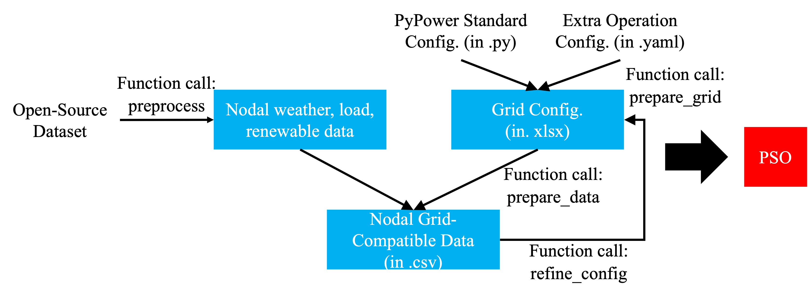

# LAPSO: Learning-Augmented Power System Operation

<p align="center">

</p>

This repository contains the code for paper *"A Unified Optimization View for Learning-Augmented Power System Operations"* by Wangkun Xu (Imperial College London), Zhongda Chu (Tianjin University), and Fei Teng (Imperial College London). The paper is under review ([preprint available](https://arxiv.org/abs/2505.05203)) and more code will be released after the review process. This repository is maintained by Wangkun Xu.

This repo contains complete functions for reimplementing the experiments in the paper. And the dedicated python packages for `pso` and `lapso` will be released soon.

> **Funding.** This work is funded by EPSRC under Grant EP/Y025946/1 and Leverhulme Trust.

> **Developing Plan.**  We will release the `lapso` package via PyPI soon.


Two main packages are included:
- `pso`: for automatic power system testbed and data generation.
- `lapso`: for automatic integrating machine learning models into existing power system optimization models.

Together with the detailed experiments mentioned in the paper, as applications of LAPSO.

The structure of the repository is
```
LAPSO_EXP
├── lapso/                  # The main folder for LAPSO (can be used independently, **coming soon**)
├── pso/                    # The folder for power system data and configuration generator (can be used independently)
    ├── preprocess.py       # Functions to preprocess the raw data into bus-level data
├── requirements.txt        # The dependencies of the project (**coming soon**)
├── README.md               # This file
├── paper_exp/              # The folder for runing the case studies in the paper
    ├── obf_func.py           # Helper functions for obf
    ├── sco_func.py           # Helper functions for sco
    ├── train_abf_nn.py       # NN-based P_{train}^{abf}
    ├── obf_basic.py          # Experiment on P_{train}^{obf/basic}
    ├── obf_sco.py            # Experiment on P_{train}^{obf/sco}
    ├── obf_sco_grad.py       # Experiment on sensitivity analysis of ABF, OBF/Basic, and SCO
    ├── sco.py                # Experiment on P_{train}^{sco}
    ├── sco_active_sample.py  # Experiment on P_{train}^{sco} with active sampling for large systems
    └── obf_uncer.py          # Experiment on P_{train}^{obf/uncer}
├── conf/                   # The folder for the configuration files, managed by hydra (only used for calling `pso` and the case studies in the paper)
    ├── exp/                  # Configs for paper experiments
    ├── grid/                 # Configs for power system grids
    └── operation/            # Configs for power system operations
└── data/                   # The folder for the raw and processed data files (only used for the case studies in the paper)
```

## What is LAPSO?

**Learning-augmented power system operation (LAPSO)** is a unified framework on designing machine learning algorithm with existing power system decision-makings  including forecasting/modelling, operation, and control. We believe that in the near future, instead of **replacing** physical model-based decision-making with black-box machine learning models, the **integration** of machine learning and physical model-based decision-making will be the mainstream in power system operation.

Therefore, LAPSO follows two standards,
1. Siloed design of forecasting, operation, and control must be integrated to improve grid flexibility, and
2. The accuracy of ML model must be traded-off by its impact to existing optimization problems interacted with.

## Quickly Run All the Experiments in the Paper

We provided scripts to quickly run all the experiments in the paper. The experiments are mainly based on the bus-14, bus-39, bus-57, bus-118, and bus-300 systems.

### Data and Grid Preparation

> Detailed data generation process is explained in the `pso` package section below.

First download the data [here](https://figshare.com/ndownloader/files/39478540). Copy the ```.zip``` file under `data/` and rename it to `raw_data.zip`.

Then run the following command to preprocess the data:
```bash
sh preprocess.sh
```

Then generate the grid and corresponding data:
```bash
python prepare.py grid=<grid_name> operation=<operation_name> force_new_grid=true force_new_data=true
```
With ```grid_name = {bus14, bus39, bus57, bus118, but300}``` and ```operation_name = {bus14_discrete, bus39_discrete, bus57_discrete, bus118_discrete, bus300_discrete}``` to generate all the systems and data used in the paper.

For example, to generate the bus14 system and data, you should run
```bash
python prepare.py grid=bus14 operation=bus14_discrete force_new_grid=true force_new_data=true
```

> `dicrete` represents unit commitment with full commitment variables. The `force_new_grid` and `force_new_data` are set to true to force generating new grid and data. If you have already generated the grid and data, you can set them to false to save time.

### Bus-14 SCO (Section VII-A in the paper)

All the SCO experiment on bus-14 system can be run by single command
```bash
sh run_sco.sh
```

This will automatically learn data-driven small signal stability assessors using both linear and NN-based models. The trained assessors will be integrated into the unit commitment problem via SCO framework.

The results will be saved in `paper_exp/sco_result/``.

### Bus-14 OBF (Section VII-B in the paper)

All the forecasting related experiments on bus-14 system, including ABF, OBF/Basic, OBF/SCO, OBF/Uncer can be run by single command
```bash
sh run_obf.sh
```

This includes train a ABF model for renewable generation forecasting; basic OBF; OBF with SCO as optimization; robust OBF with uncertain loads at RD stage (under 1%, 3%, 5%, and 7% budget); and the cosine similarity analysis between the models trained by ABF, OBF/Basic, and OBF/SCO.

### SCO for Large System (Appendix B in the paper)

```
python run_sco_active_sample.py
```
This will automatically run SCO on bus-14, bus-39, bus-57, bus-118, and bus-300 systems with active sampling strategy for large systems. Note that the dataset (such as renewable penetration) will be rescaled based on the data generated in first step and extra data will be sampled around the gSCR boundary. The bus-14 system is rerun here for comparison using `gurobi` solver.


### OBF/Uncer for Large System (Appendix C in the paper)

```
python run_obf_uncer_large.py
```
This will automatically run OBF/Uncer on bus-14, bus-39, bus-57 systems with 5% load uncertainty budget. The dataset generated in step one will be used here.

## Power System Operation (`PSO` package)


*Figure 1: The framework of power system operation (PSO) package. The PSO package provides automatic power system testbed and data generation for end-to-end machine learning-optimization applications.*

### Step 1: Preprocess

The first step is to preprocess raw data. We use the data from open-souce [TX-123BT system](https://rpglab.github.io/resources/TX-123BT/) and [the paper: A synthetic Texas power system with time-series weather-dependent spatiotemporal profiles](https://www.sciencedirect.com/science/article/pii/S2352467725001560). First download the data [here](https://figshare.com/ndownloader/files/39478540). Copy the ```.zip``` file under `data/` and rename it to `raw_data.zip`

> **About dataset.** The dataset from the above link is preperable as it contains data that has both temporal and spatial correlations. The weather data, as well as load and renewable generation data is allocated to each bus in one system. Therefore it is very suitable for building end-to-end machine learning and system-wise grid optimization. If you are aware of other datasets with similar properties, please let us know!

Then run the following command to preprocess the data:
```bash
sh preprocess.sh
```

The data associated to each bus (there are 123 buses in total) will be saved in `data/bus_data/bus_{idx}`. Each dataframe contains columns ['Weekday_sin', 'Weekday_cos', 'Hour_sin', 'Hour_cos', 'Temperature (k)', 'Shortwave Radiation (w/m2)', 'Longwave Radiation (w/m2)', 'Zonal Wind Speed (m/s)', 'Meridional Wind Speed (m/s)', 'Wind Speed (m/s)', 'Load', 'Solar', 'Wind']. The periodicity features such as weekday and hour are represented by the cosine and sin waves with corresponding periods.

> **Preprocessing time.** Step one may take a while as the raw data is large. After the first time, you can skip this step and directly use the preprocessed data in `data/bus_data/`.

### Step 2: Prepare Grid

The test case in the paper is generated from the standard IEEE test systems given by [PyPower](https://github.com/rwl/PYPOWER). See the bus14 example online [here](https://github.com/rwl/PYPOWER/blob/master/pypower/case14.py). The PyPower configurations conain the basic power system information and to be able to implement complex opeation such as UC, extra configurations are needed. 

> Detailed definition to the configurations can be found [here](pso/readmd.md).

To modify the existing configurations or add new ones, another config file must be provided in `.yaml` format. The **default** configurations can be overwritten and **extra** configurations can be added. Please refer to [bus14.yaml](conf/grid/bus14.yaml) as reference. For example, 
- to reset the generator active power limits, you can use the following entry:
```yaml
gen:
    PMAX:
      format: value 
      value: [160,140,100,120,150]
    PMIN:
      format: value 
      value: [16,14,10,12,15]
```
the `format: value` means the exact value is provided in the `value` field. 

> **Note**: You must use the same name as in the default configurations if you want to overwirte them. Please refer to the [MatPower User Manual](https://matpower.org/docs/manual.pdf) Page 141-144 for the existing configurations.

- To add a new configuration (that is not included in the default configurations), you can just define new entry: for example, to add solar generation,
```yaml
solar:
    INDEX:
      format: value 
      value: [5,11,13,14]
    CAPACITY_RATIO:
      format: value 
      value: [0.1,0.06,0.05,0.15]
    CURTAIL:
      format: value 
      value: [110.0,120.0,130.0,80.0]
```

This is achieved by `pso.prepare_grid_from_pypower()` function.

#### Explanation of the configuration file:
- `rescale_load`: if True, the nominal load is rescaled so that the aggregate load is equal to the aggregate generation capacity without the maximum one.
- `CAPACITY_RATIO` (under the `wind` and `solar` section): the ratio of each renewable capacity with respect to the aggregate nominal load (after rescaling if `rescale_load` is True).

### Step 3: Prepare Data

The raw data in Step 1 can not be directly used for the power system testbed generated in Step 2. For example, we need to assign solar and/or wind resources to the correct buses. Meanwhile, the load and renewable data need to be rescaled to match the power system capacity.

This is achieved by `pso.prepare_data()` function and results will be saved in `data/bus_{name}` folder. 

### Step 4: Refine Config

The `pso` package takes one more step to refine the configurations based on the testbed in Step 2 and data in Step 3. For example, the power flow limit of each branch is rescaled to ensure the system is secure.

This is achieved by `pso.refine_config()` function.

## Learning-Augmented Power System Operation (`lapso` package)

The full `lapso` package is stored in `lapso/` folder. We aim to release the package via PyPI soon.