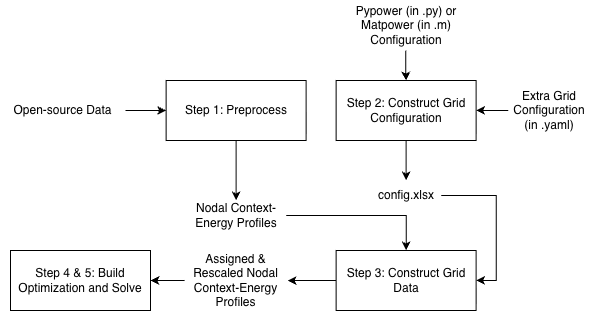

# LAPSO: Learning-Augmented Power System Operation

<p align="center">

</p>

> **Important Update Aug. 10 2026**: The paper is accepted by the IEEE Transactions on Power Systems.

> **Important Update Aug. 01 2026**: Based on the LAPSO framework, we have open-sourced a new differentable optimization package for efficient objective-based forecasting with Neural Network-based forecaster. Please refer to the [DiffAPQP](https://github.com/xuwkk/diffapqp) repository, [documentation](https://xuwkk.github.io/diffapqp/), [pip install diffapqp](https://pypi.org/project/diffapqp/), and [arXiv preprint](https://arxiv.org/abs/2608.04189).

> **Important Update**: The `pso` package has been published as a standalone package, and renamed as `GridForge`. Please refer to the [GridForge](https://github.com/xuwkk/gridforge) repository for the latest updates. You can now install the `GridForge` package by `pip install powergridforge`.

This repository contains the code for paper *"A Unified Optimization View for Learning-Augmented Power System Operations"* by Dr. Wangkun Xu (Imperial College London), Prof. Zhongda Chu (Tianjin University), and Prof. Fei Teng (Imperial College London). The paper is under review ([preprint available](https://arxiv.org/abs/2505.05203)) and more code will be released after the review process. This repository is maintained by Wangkun Xu.

> This repo contains complete functions for reimplementing the experiments in the paper. And the dedicated python package for `lapso` will be released soon.

> **Funding.** This work is funded by EPSRC under Grant EP/Y025946/1 and Leverhulme Trust.


Two main packages are included:
- `pso`: for automatic power system testbed and data generation (renamed into `GridForge`).
- `lapso`: for automatic integrating machine learning models into existing power system optimization models.

Together with the detailed experiments mentioned in the paper, as applications of LAPSO.

The structure of the repository is
```
LAPSO_EXP
├── readme.md                     # This file
├── environment.yml               # Conda environment definition
├── preprocess.sh                 # Data preprocessing entry script
├── prepare.py                    # Grid/data generation entry script
├── convert_mat_to_py.py          # MATPOWER -> PYPOWER conversion utility
├── run_sco.sh                    # Run SCO experiments (bus-14)
├── run_obf.sh                    # Run OBF-related experiments (bus-14)
├── run_sco_active_sample.py      # SCO experiments for large systems
├── run_obf_uncer_large.py        # OBF/Uncer experiments for large systems
├── run_obf_uncer_multi.sh        # OBF/Uncer under multiple uncertainty sources
├── draw_sco.py                   # SCO plotting script
├── draw_obf.py                   # OBF plotting script
├── draw_sco_active_sampling.py   # Plot active-sampling SCO results
├── conf/                         # Hydra configs for experiments/grids/operations
│   ├── exp/
│   ├── grid/
│   └── operation/
├── paper_exp/                    # Paper experiment implementations
│   ├── sco.py                    # SCO experiment implementation for bus-14 system
│   ├── sco_active_sample.py      # SCO experiments for large systems
│   ├── sco_func.py               # SCO function implementations
│   ├── train_abf_nn.py          # ABF model training
│   ├── obf_func.py              # OBF function implementations
│   ├── obf_basic.py             # Basic OBF experiment
│   ├── obf_sco.py               # OBF with SCO experiment
│   ├── obf_sco_grad.py          # OBF with SCO gradient experiment
│   ├── obf_uncer.py             # OBF with uncertainty experiment
│   └── obf_uncer_multi.py       # OBF with multiple uncertainty sources experiment
├── pso/                          # Grid/data preparation and optimization utilities
│   ├── preprocess.py             # Data preprocessing
│   ├── prepare.py                # Grid/data preparation
│   ├── solve_opt.py              # Optimization solving
│   └── operation_basic.py        # Basic operation utilities
├── lapso/                        # LAPSO model/training utilities
│   ├── neuralnet.py              # Neural network model
│   ├── neuralnet_funcs.py        # Neural network function implementations
│   └── optimization.py           # Optimization utilities
└──  data/                         # Raw and processed datasets
```
with other scripts for drawing the figures in the paper.

## What is LAPSO?

**Learning-augmented power system operation (LAPSO)** is a unified framework on designing machine learning algorithm with existing power system decision-makings  including forecasting/modelling, operation, and control. We believe that in the near future, instead of **replacing** physical model-based decision-making with black-box machine learning models, the **integration** of machine learning and physical model-based decision-making will be the mainstream in power system operation.

Therefore, LAPSO follows two standards,
1. Siloed design of forecasting, operation, and control must be integrated to improve grid flexibility, and
2. The accuracy of ML model must be traded-off by its impact to existing optimization problems interacted with, e.g., the optimization-aware metrics.

## Quickly Run All the Experiments in the Paper

We provided scripts to quickly run all the experiments in the paper. The experiments are mainly based on the bus-14, bus-39, bus-57, bus-118, and bus-300 systems.

## Installation
```bash
conda env create -f environment.yml
conda activate lapso_exp
```

### Data and Grid Preparation

> Detailed data generation process is explained in the `pso` package section below.

First download the data [here](https://figshare.com/ndownloader/files/39478540). Copy the ```.zip``` file under `data/` and rename it to `raw_data.zip`.

Then run the following command to preprocess the data:
```bash
sh preprocess.sh
```

Then generate the grid and corresponding data:
```bash
python prepare.py grid=<grid_name> operation=<operation_name> force_new_grid=true force_new_data=true
```
With ```grid_name = {bus14, bus39, bus57, bus118, bus300}``` and ```operation_name = {bus14_discrete, bus39_discrete, bus57_discrete, bus118_discrete, bus300_discrete}``` to generate all the systems and data used in the paper.

For example, to generate the bus14 system and data, you should run
```bash
python prepare.py grid=bus14 operation=bus14_discrete force_new_grid=true force_new_data=true
```
> `discrete` represents unit commitment with full commitment variables. The `force_new_grid` and `force_new_data` flags are set to `true` to force regeneration of the grid and data. If you have already generated them, set both to `false` to save time.

### Convert Matpower Cases to Pypower Cases
To run matpower cases that are not included in the pypower package, you can use the `convert_mat_to_py.py` script to convert the matpower case to a pypower case. For example, to convert the `case1888rte.m` case to a pypower case, you can run
```bash
python convert_mat_to_py.py --case_name case1888rte --regularize_bus_indices
```
This will convert the `case1888rte.m` case to a pypower case and save it as `case1888rte.py`. You can then use the `case1888rte.py` case in the pypower package. The `--regularize_bus_indices` flag is used to regularize the bus indices to be continuous from 1 to the number of buses.

Then follow the same steps to generate the grid and data such as

```bash
python -u prepare.py grid=bus1888rte force_new_grid=true force_new_data=true operation=bus1888rte optimization.option.TimeLimit=7200 optimization.option.verbose=true
```
But it takes a long time to solve.

### Bus-14 SCO (Section VII-A in the paper)

All the SCO experiment on bus-14 system can be run by single command
```bash
sh run_sco.sh
```

This will automatically learn data-driven small signal stability assessors using both linear and NN-based models. The trained assessors will be integrated into the unit commitment problem via SCO framework.

#### Topology-Change gSCR Check

The SCO pipeline now includes an additional comparison between the base topology and a single-line-outage topology obtained by tripping the in-service transmission line with the smallest reactance. This is intended as a simple stress-test for the generalized short-circuit ratio (gSCR).

The results will be saved in `paper_exp/sco_result/`.

### Bus-14 OBF (Section VII-B in the paper)

All the forecasting related experiments on bus-14 system, including ABF, OBF/Basic, OBF/SCO, OBF/Uncer can be run by single command
```bash
sh run_obf.sh
```

This includes train a ABF model for renewable generation forecasting; basic OBF; OBF with SCO as optimization; robust OBF with uncertain loads at RD stage (under 1%, 3%, 5%, and 7% budget); and the cosine similarity analysis between the models trained by ABF, OBF/Basic, and OBF/SCO.

### SCO for Large System (Appendix B in the paper)

```
python run_sco_active_sample.py
```
This will automatically run SCO on bus-14, bus-39, bus-57, bus-118, and bus-300 systems with active sampling strategy for large systems (except bus-14). Note that the dataset (such as renewable penetration) will be rescaled based on the data generated in first step and extra data will be sampled around the gSCR boundary. The bus-14 system is rerun here for comparison using `gurobi` solver.


### OBF/Uncer for Large System (Appendix C in the paper)

```
python run_obf_uncer_large.py
```
This will automatically run OBF/Uncer on bus-14, bus-39, bus-57 systems with 5% load uncertainty budget. The dataset generated in step one will be used here.

### OBF/Uncer under Multiple Uncertainty Sources (Appendix D in the paper)

```bash
sh run_obf_uncer_multi.sh
```

This runs OBF/Uncer under both ML-uncertainty (on input data) and optimization uncertainty (on RD load), matching the setup in Appendix D.

## Power System Operation (`PSO` package)

> Please refer to the [GridForge](https://github.com/xuwkk/gridforge) repository for the latest updates.


*Figure 1: The framework of power system operation (PSO) package. The PSO package provides automatic power system testbed and data generation for end-to-end machine learning-optimization applications.*

### Step 1: Preprocess

The first step is to preprocess raw data. We use the data from the open-source [TX-123BT system](https://rpglab.github.io/resources/TX-123BT/) and [the paper: A synthetic Texas power system with time-series weather-dependent spatiotemporal profiles](https://www.sciencedirect.com/science/article/pii/S2352467725001560). First download the data [here](https://figshare.com/ndownloader/files/39478540). Copy the ```.zip``` file under `data/` and rename it to `raw_data.zip`.

> **About dataset.** The dataset from the above link is preferable because it contains both temporal and spatial correlations. The weather data, as well as load and renewable generation data, is allocated to each bus in one system. Therefore it is very suitable for building end-to-end machine learning and system-wide grid optimization. If you are aware of other datasets with similar properties, please let us know.

Then run the following command to preprocess the data:
```bash
sh preprocess.sh
```

The data associated to each bus (there are 123 buses in total) will be saved in `data/bus_data/bus_{idx}`. Each dataframe contains columns ['Weekday_sin', 'Weekday_cos', 'Hour_sin', 'Hour_cos', 'Temperature (k)', 'Shortwave Radiation (w/m2)', 'Longwave Radiation (w/m2)', 'Zonal Wind Speed (m/s)', 'Meridional Wind Speed (m/s)', 'Wind Speed (m/s)', 'Load', 'Solar', 'Wind']. The periodicity features such as weekday and hour are represented by the cosine and sin waves with corresponding periods.

> **Preprocessing time.** Step one may take a while as the raw data is large. After the first time, you can skip this step and directly use the preprocessed data in `data/bus_data/`.

### Step 2: Prepare Grid

The test case in the paper is generated from the standard IEEE test systems provided by [PyPower](https://github.com/rwl/PYPOWER). See the bus14 example online [here](https://github.com/rwl/PYPOWER/blob/master/pypower/case14.py). The PyPower configurations contain the basic power system information, and extra configurations are needed to implement complex operations such as UC.

> Detailed definition to the configurations can be found [here](pso/readmd.md).

To modify the existing configurations or add new ones, another config file must be provided in `.yaml` format. The **default** configurations can be overwritten and **extra** configurations can be added. Please refer to [bus14.yaml](conf/grid/bus14.yaml) as reference. For example, 
- to reset the generator active power limits, you can use the following entry:
```yaml
gen:
    PMAX:
      format: value 
      value: [160,140,100,120,150]
    PMIN:
      format: value 
      value: [16,14,10,12,15]
```
the `format: value` means the exact value is provided in the `value` field. 

> **Note**: You must use the same names as in the default configurations if you want to overwrite them. Please refer to the [MatPower User Manual](https://matpower.org/docs/manual.pdf), pages 141-144, for existing configurations.

- To add a new configuration (that is not included in the default configurations), you can just define new entry: for example, to add solar generation,
```yaml
solar:
    INDEX:
      format: value 
      value: [5,11,13,14]
    CAPACITY_RATIO:
      format: value 
      value: [0.1,0.06,0.05,0.15]
    CURTAIL:
      format: value 
      value: [110.0,120.0,130.0,80.0]
```

This is achieved by `pso.prepare_grid_from_pypower()` function.

#### Explanation of the configuration file:
- `rescale_load`: if True, the nominal load is rescaled so that the aggregate load is equal to the aggregate generation capacity without the maximum one.
- `CAPACITY_RATIO` (under the `wind` and `solar` section): the ratio of each renewable capacity with respect to the aggregate nominal load (after rescaling if `rescale_load` is True).

### Step 3: Prepare Data

The raw data in Step 1 can not be directly used for the power system testbed generated in Step 2. For example, we need to assign solar and/or wind resources to the correct buses. Meanwhile, the load and renewable data need to be rescaled to match the power system capacity.

This is achieved by `pso.prepare_data()` function and results will be saved in `data/bus_{name}` folder. 

### Step 4: Refine Config

The `pso` package takes one more step to refine the configurations based on the testbed in Step 2 and data in Step 3. For example, the power flow limit of each branch is rescaled to ensure the system is secure.

This is achieved by `pso.refine_config()` function.

## Learning-Augmented Power System Operation (`lapso` package)

The full `lapso` package is stored in `lapso/` folder. We aim to release the package via PyPI soon.
